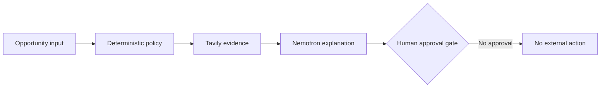

# Small-Stake Sentinel

Small-Stake Sentinel is a human-gated AI agent for evaluating tiny business experiments without quietly spending the user's money. It combines:

- deterministic bankroll and exposure rules;
- Tavily evidence retrieval;
- NVIDIA Nemotron reasoning through Nebius Token Factory;
- a hard approval gate before payment or any external commitment.

The project was created for the Nebius x NVIDIA Global AI Hackathon. The current repository runs in deterministic demo mode when API keys are absent, so the interface and safety logic can be tested without spending money.

## Architecture



The language model explains a policy result; it never controls or rewrites the policy layer.

## Run locally

```bash
npm start
```

Open <http://localhost:3000>. To enable live integrations:

```bash
NEBIUS_API_KEY=... TAVILY_API_KEY=... npm start
```

Optional environment variables:

- `NEBIUS_MODEL`
- `NEBIUS_BASE_URL`
- `PORT`

## Safety model

The model can explain and rank an opportunity, but it cannot override hard policy checks. Any positive cash input or external commitment returns a blocked human-approval gate. The app never executes a purchase, payment, order, message, or contract.

## Tests

```bash
npm test
```

## License

MIT
